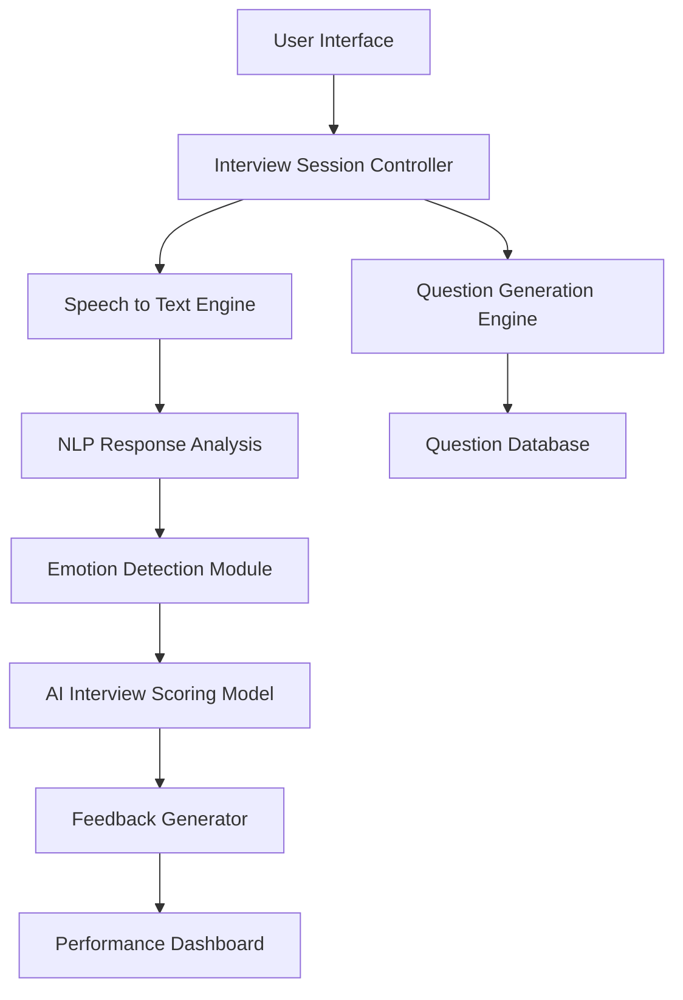
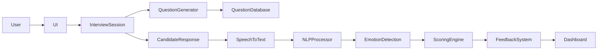
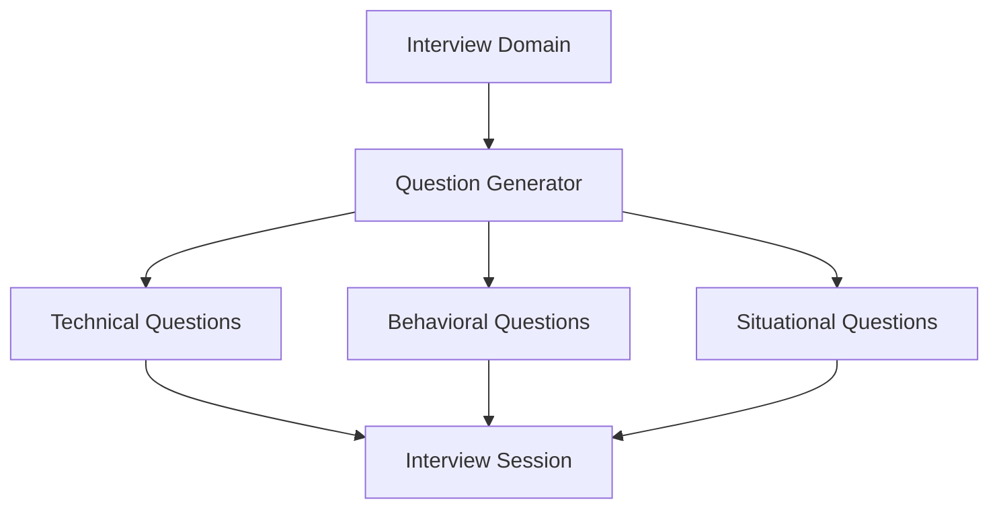
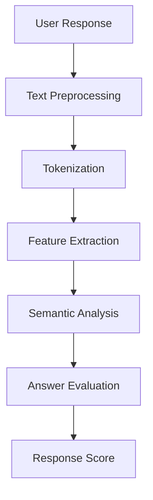
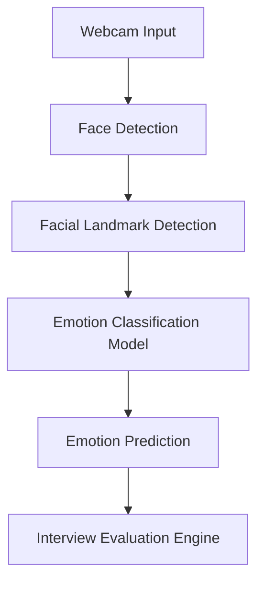
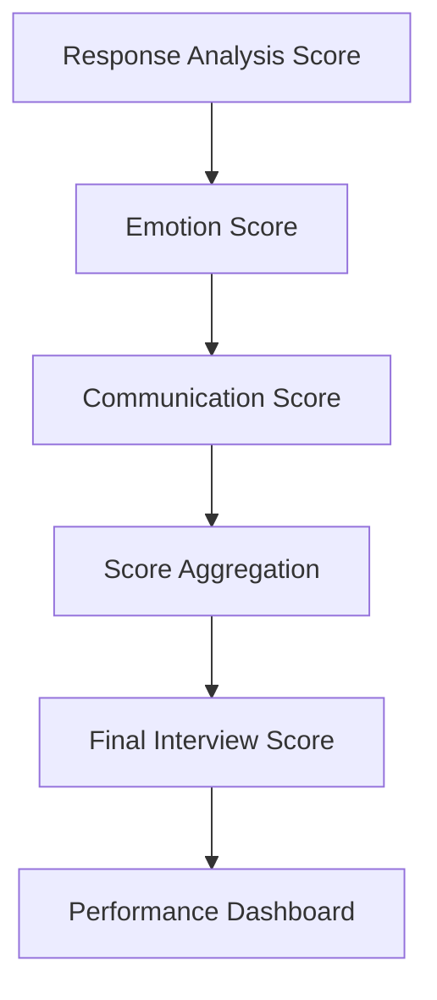

# AI Interview Coach

### An Intelligent AI-Powered Interview Preparation Platform

---

# Abstract

AI Interview Coach is an intelligent interview preparation platform designed to simulate real interview scenarios using artificial intelligence, natural language processing (NLP), and computer vision techniques. The system enables users to practice mock interviews, analyze their responses, detect emotional states, and receive automated performance feedback.

Traditional interview preparation often lacks structured feedback and real-time evaluation. AI-based mock interview systems address this problem by analyzing candidate responses, speech patterns, and behavioral cues such as facial expressions and emotional states to generate objective performance evaluations. ([IJNRD][1])

The AI Interview Coach system integrates multiple AI components including question generation, speech-to-text conversion, natural language processing, emotion detection, and AI-driven scoring models. These modules work together to create a comprehensive interview simulation environment that helps candidates improve communication skills, confidence, and technical knowledge.

---

# 1. Introduction

Job interviews are one of the most important stages in the hiring process. Candidates must demonstrate technical knowledge, communication skills, and confidence under pressure. However, many individuals struggle with interview preparation due to lack of practice opportunities and structured feedback.

Artificial intelligence technologies have enabled the development of automated interview coaching systems capable of simulating real interview environments. These systems analyze candidate responses, evaluate communication quality, and detect behavioral signals such as confidence and emotional states. ([IJRPR][2])

AI Interview Coach is designed to provide an interactive and intelligent interview training environment where users can:

* Practice technical and behavioral interviews
* Receive automated feedback
* Analyze emotional responses during interviews
* Track performance metrics

The system aims to improve interview readiness by providing personalized insights into candidate performance.

---

# 2. Problem Statement

Preparing for job interviews presents several challenges:

1. Lack of real interview practice
2. Limited feedback during preparation
3. Difficulty identifying weaknesses in responses
4. Anxiety during real interviews
5. Subjective evaluation in traditional mock interviews

Conventional preparation methods such as reading interview questions or practicing with friends often fail to simulate real interview pressure.

The AI Interview Coach system addresses these limitations by providing an automated interview evaluation platform that analyzes responses, communication quality, and emotional behavior.

---

# 3. System Overview

The AI Interview Coach system simulates a real interview process through the following workflow:

1. User selects interview domain
2. AI generates interview questions
3. Candidate responds through speech or text
4. System analyzes response using NLP
5. Emotion detection analyzes facial expressions
6. AI scoring engine evaluates candidate performance
7. Performance report is generated

This workflow creates an interactive and intelligent interview preparation environment.

---

# 4. Overall System Architecture

---

# Architecture Explanation

The system architecture consists of several interconnected modules responsible for managing interview sessions, analyzing responses, and generating performance feedback.

The user interacts with the system through a web interface. The interview controller manages the session and communicates with other modules such as the question generator, response analyzer, and scoring engine.

Responses are analyzed using NLP techniques while facial expressions are processed through emotion detection algorithms. These results are combined by the scoring engine to generate a final interview performance score.

---

# 5. Data Flow Architecture

---

# Data Flow Explanation

The system begins when the user starts an interview session from the interface. The question generator retrieves relevant interview questions from a database.

The user responds to the question through voice or text input. If voice input is used, speech-to-text conversion is applied before the response is analyzed using NLP algorithms.

Simultaneously, the system analyzes facial expressions through the webcam to detect emotions such as confidence, stress, or nervousness.

The scoring engine combines linguistic and emotional analysis to generate performance feedback.

---

# 6. Question Generation Module

### Explanation

The question generation module retrieves questions based on the selected domain or job role.

Types of questions include:

* Technical questions
* Behavioral questions
* Situational questions

This variety ensures that the system simulates realistic interview scenarios.

---

# 7. Response Analysis Architecture

### Explanation

The response analysis module evaluates candidate answers using NLP techniques.

Processing stages include:

* Cleaning and preprocessing text
* Tokenization
* Feature extraction
* Semantic analysis
* Response scoring

These steps allow the system to assess relevance, clarity, and completeness of responses.

---

# 8. Emotion Detection Module

Emotion detection analyzes candidate facial expressions during interview sessions.

Emotion recognition systems use computer vision and deep learning algorithms to identify emotional states by analyzing facial features and expressions captured through a webcam. ([Wikipedia][3])

### Emotion Detection Architecture

### Detected Emotions

* Confidence
* Nervousness
* Neutral state
* Happiness
* Stress

These emotional indicators help evaluate candidate behavior during interviews.

---

# 9. AI-Driven Interview Scoring Model

The scoring model evaluates candidate performance using multiple evaluation metrics.

### Evaluation Parameters

* Response relevance
* Communication clarity
* Technical knowledge
* Emotional confidence
* Response structure

### Scoring Architecture

The system aggregates multiple evaluation parameters to generate a final interview score.

---

# 10. Technology Stack

| Component            | Technology                  |
| -------------------- | --------------------------- |
| Programming Language | Python                      |
| Backend Framework    | Flask                       |
| Frontend             | HTML, CSS, JavaScript       |
| NLP Libraries        | NLTK, Transformers          |
| Machine Learning     | TensorFlow / PyTorch        |
| Computer Vision      | OpenCV                      |
| Speech Processing    | SpeechRecognition / Whisper |
| Data Processing      | Pandas, NumPy               |

---

# 11. Key Features

* AI-generated interview questions
* Real-time interview simulation
* Speech-to-text response processing
* NLP-based answer analysis
* Emotion detection using computer vision
* AI-driven interview scoring system
* Interactive performance dashboard
* Personalized feedback generation

---

# 12. Applications

AI Interview Coach can be used in several domains:

### Career Preparation

Students and job seekers can practice interviews and improve their communication skills.

### Educational Institutions

Universities can use the system to train students in interview preparation.

### Corporate Training

Organizations can use AI interview coaching platforms to train employees and evaluate candidates.

### Online Learning Platforms

The system can be integrated into career development and skill-building platforms.

---

# 13. Advantages

* Provides realistic interview simulation
* Offers automated and objective feedback
* Enables unlimited interview practice
* Reduces interview anxiety
* Improves communication and confidence

---

# 14. Limitations

* AI models may occasionally produce incorrect evaluations
* Emotion detection accuracy depends on camera quality and lighting conditions
* NLP models require continuous training for better accuracy
* High computational resources may be required for real-time processing

---

# 15. Future Improvements

Possible enhancements for the system include:

* Resume-based question generation
* AI interviewer avatars
* Real-time interview coaching suggestions
* Gesture and body language analysis
* Recruiter dashboard for candidate evaluation

---

# 16. Conclusion

AI Interview Coach demonstrates how artificial intelligence can transform interview preparation by providing interactive and intelligent interview simulations. By integrating NLP, computer vision, and machine learning techniques, the platform enables automated evaluation of candidate responses and behavioral cues.

The modular architecture allows the system to scale and integrate advanced AI technologies such as large language models, multimodal analysis, and conversational agents. As AI technologies continue to evolve, intelligent interview coaching systems will become an essential tool for career preparation and professional development.
