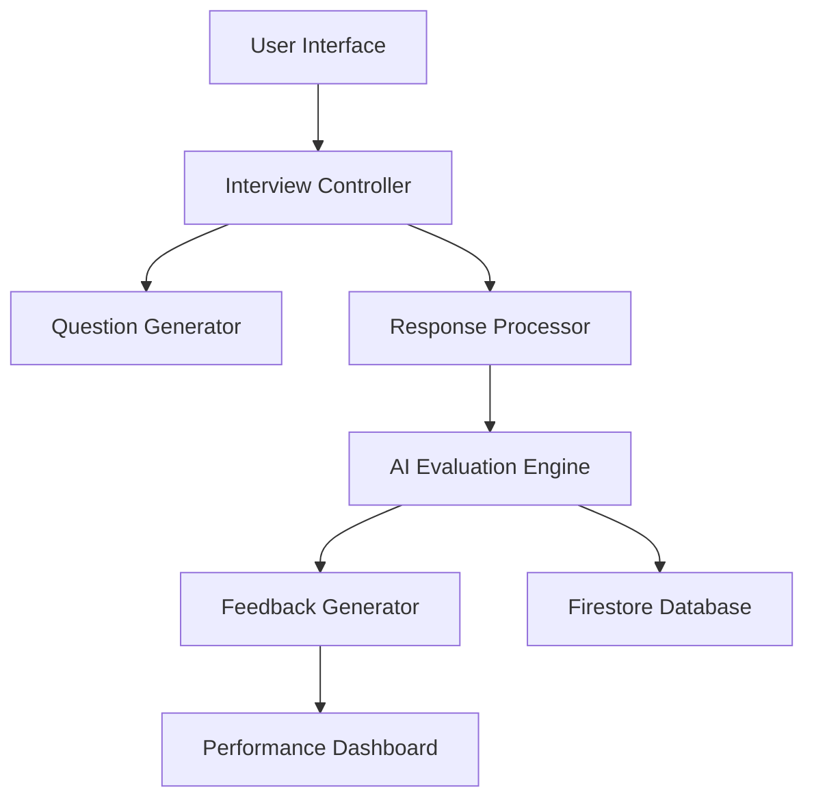
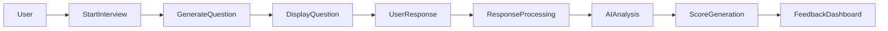

# AI Interview Coach

### AI-Powered Mock Interview Preparation Platform


AI Interview Coach is an **AI-driven mock interview platform** that helps users practice interviews and receive automated feedback.

The system simulates real interview environments by generating questions, analyzing responses, and evaluating performance.

This project demonstrates how modern web technologies and AI techniques can be used to improve interview preparation.

---

# Demo
```
Live Demo: https://ai-interview-coachh-9qns.vercel.app/ 
```

---

# Features

* Mock interview simulation
* AI-generated interview questions
* Automated response evaluation
* Interactive interview interface
* Performance feedback dashboard
* Firebase backend integration
* Scalable modular architecture

---

# System Architecture



### Architecture Explanation

The system consists of several modules:

1. **User Interface** – Web application where users interact.
2. **Interview Controller** – Manages interview sessions.
3. **Question Generator** – Provides interview questions.
4. **Response Processor** – Handles candidate answers.
5. **AI Evaluation Engine** – Analyzes responses.
6. **Feedback Generator** – Produces performance insights.
7. **Firestore Database** – Stores user and interview data.

---

# System Workflow



### Workflow Steps

1. User starts interview session.
2. System generates a question.
3. Candidate provides response.
4. System processes response.
5. AI evaluates answer.
6. Score is calculated.
7. Feedback is displayed.

---

# Project Structure

```
AI-interview-coachh
│
├── src/                     # Core application source code
│
├── index.html               # Main frontend entry point
├── server.ts                # Backend server logic
│
├── package.json             # Node dependencies
├── package-lock.json        # Dependency lock file
│
├── tsconfig.json            # TypeScript configuration
├── vite.config.ts           # Vite build configuration
│
├── firebase-blueprint.json  # Firebase configuration
├── firestore.rules          # Firestore database rules
│
├── metadata.json            # Project metadata
├── .gitignore
│
└── README.md
```

---

# Prerequisites

Before running this project, make sure you have installed:

* Node.js (v16+ recommended)
* npm or yarn
* Firebase account

---

# Installation

## Clone the repository

```bash
git clone https://github.com/KirtiPratihar/AI-interview-coachh.git
cd AI-interview-coachh
```

---

## Install dependencies

```bash
npm install
```

---

# Firebase Setup

1. Create a Firebase project.
2. Enable **Firestore Database**.
3. Update configuration in:

```
firebase-blueprint.json
```

4. Configure Firestore rules using:

```
firestore.rules
```

---

# Run the Project

Start the development server:

```bash
npm run dev
```

The application will run at:

```
http://localhost:5173
```

---

# Build for Production

```bash
npm run build
```

---

# Deployment

You can deploy this project using:

* Firebase Hosting
* Vercel
* Netlify

Example (Firebase):

```
firebase deploy
```

---

# Usage

1. Open the application.
2. Start a mock interview session.
3. The system generates a question.
4. Provide your response.
5. The system evaluates your answer.
6. Feedback and performance score are displayed.

---
## Screenshots

### Home Page


### Configure your session


### Interview Session


### Feedback Dashboard


---

# Advantages

* Realistic interview simulation
* Automated performance evaluation
* Interactive user interface
* Scalable architecture

---

# Limitations

* AI scoring accuracy depends on training data
* Requires internet connection
* Depends on backend service availability

---

# Future Improvements

* Voice response analysis
* AI interviewer avatar
* Resume-based question generation
* Interview analytics dashboard

---

# Contributing

Contributions are welcome.

Steps:

1. Fork the repository
2. Create a feature branch
3. Commit your changes
4. Submit a pull request

---

# License

This project is licensed under the **MIT License**.

---

# Author

Kirti Pratihar

GitHub:
[https://github.com/KirtiPratihar](https://github.com/KirtiPratihar)
